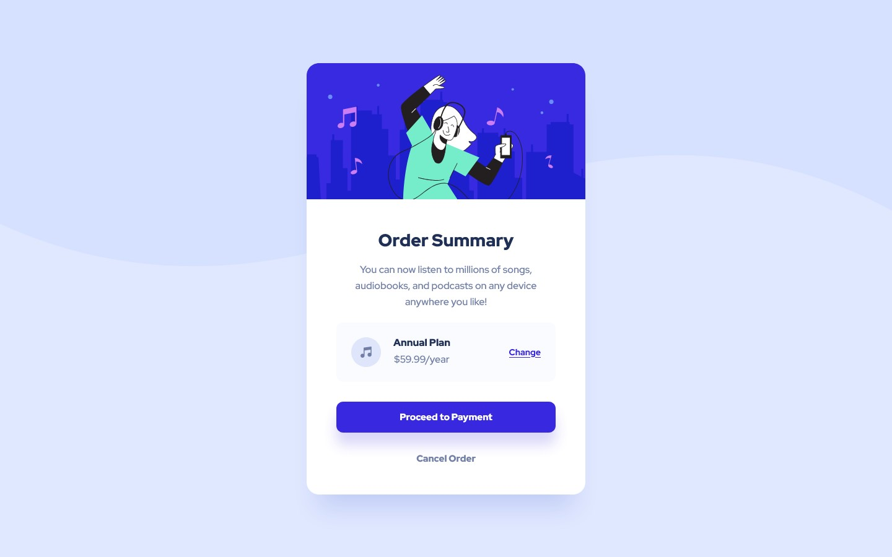

# Frontend Mentor - Order summary card solution

This is a solution to the [Order summary card challenge on Frontend Mentor](https://www.frontendmentor.io/challenges/order-summary-component-QlPmajDUj). Frontend Mentor challenges help you improve your coding skills by building realistic projects.

## Table of contents

- [Frontend Mentor - Order summary card solution](#frontend-mentor---order-summary-card-solution)
  - [Table of contents](#table-of-contents)
  - [Overview](#overview)
    - [The challenge](#the-challenge)
    - [Screenshot](#screenshot)
    - [Links](#links)
    - [Built with](#built-with)
  - [Author](#author)

## Overview

### The challenge

Users should be able to:

- See hover states for interactive elements

### Screenshot

### Links

- Solution URL: https://github.com/baldmannnnn/order-summary-component-frontend-mentor-challenge
- Live Site URL: https://order-summary-component-frontend-mentor-challenge.vercel.app/

### Built with

- SASS
- Flexbox
- Mobile-first workflow

## Author

- Frontend Mentor - https://www.frontendmentor.io/profile/baldmannnnn
- Twitter - https://twitter.com/baldoooooman
